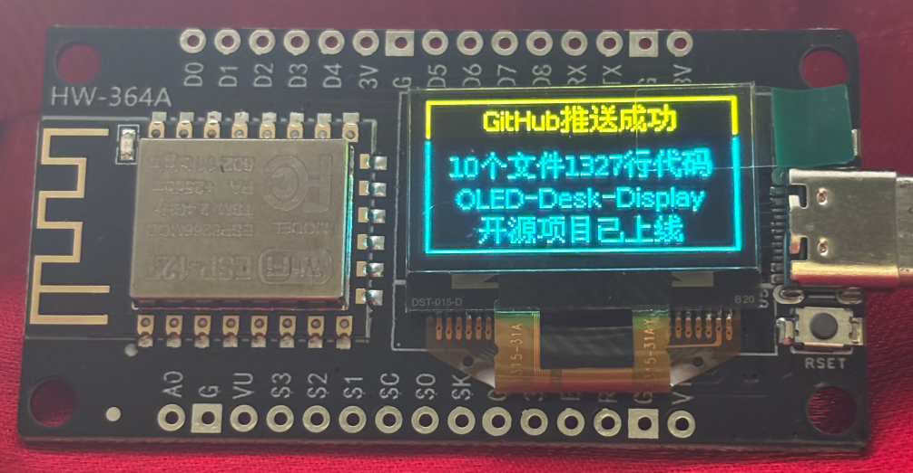
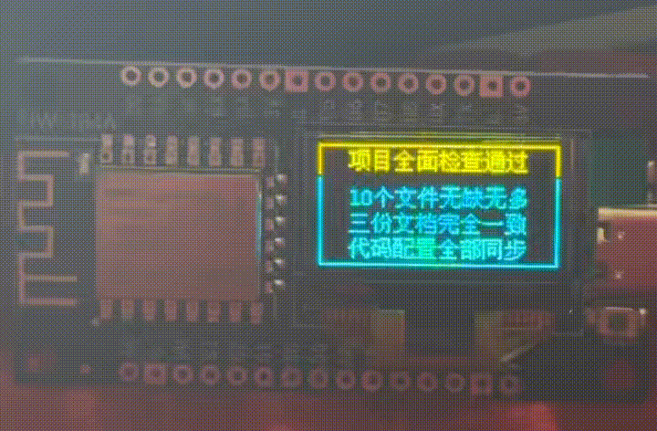

# 🖥️ AI Agent 桌面小屏幕 — 小白保姆级教程

> 这是一个能放在你电脑旁边的 OLED 小屏幕，它会实时显示你的 AI Agent 正在干什么（工作中 / 成功了 / 失败了）。
> 
> 完全不需要编程基础，跟着下面的步骤一步一步来就行！

**[English Version](README_EN.md)** | **[技术文档](docs/项目文档.md)**

---

## 你需要准备什么

| 材料 | 说明 | 参考价格 |
|------|------|---------|
| ESP8266 一体板 | 带 0.96 寸 OLED 屏幕的那种（淘宝搜 "ESP8266 OLED 一体板"） | ￥15-25 |
| Micro USB 数据线 | 连接电脑用的，注意要能传数据的那种，不能只能充电 | ￥5 |
| 一台电脑 | Windows / Mac 都行 | - |

> 💡 **买板子小贴士**：搜索关键词 "ESP8266 0.96寸 OLED 一体板 NodeMCU"，选带屏幕的版本，买回来直接就能用，不用自己焊。
> 
> 🔗 **推荐购买链接**：[淘宝 - ESP8266 OLED 一体板](https://e.tb.cn/h.RhEO5NmkXbNigtq?tk=HTlngZy42Jn)

## 实物展示

<p align="center">
  
</p>

<p align="center">
  
</p>

---

## 第一步：下载项目代码

1. 点击本页面右上角绿色 **Code** 按钮 → **Download ZIP**
2. 解压到你电脑上任意位置（比如桌面）
3. 记住解压后的文件夹路径，后面要用

---

## 第二步：安装 Arduino IDE（编程软件）

### 2.1 下载 Arduino IDE

打开这个网址下载：**https://www.arduino.cc/en/software**

1. 点击 **Windows Win 10 and newer**（如果你是 Windows 10/11）
2. 如果是 Mac 选择对应的 macOS 版本
3. 下载完双击安装，一路点下一步就行

### 2.2 添加 ESP8266 支持

Arduino IDE 本身不认识我们的小板子，需要告诉它去哪里找：

1. 打开刚装好的 Arduino IDE
2. 点击左上角 **File（文件）** → **Preferences（首选项）**
3. 找到 **Additional Boards Manager URLs（附加开发板管理器网址）** 这一栏
4. 把下面这串网址复制粘贴进去：
   ```
   http://arduino.esp8266.com/stable/package_esp8266com_index.json
   ```
5. 点击 **OK** 保存

### 2.3 安装 ESP8266 支持包

1. 点击 IDE 最左侧侧边栏的 **"正方形积木"图标**（Boards Manager / 开发板管理器）
2. 在搜索框输入：`esp8266`
3. 找到 **esp8266 by ESP8266 Community**，点击 **Install（安装）**
4. 等它下载完成，显示 **Installed** 就行了（可能需要 1-2 分钟，耐心等）

> ⚠️ 如果下载很慢或失败，可能是网络问题。多试几次，或者挂个梯子。

---

## 第三步：安装屏幕驱动库

1. 点击最左侧侧边栏的 **"抽屉/书架"图标**（Library Manager / 库管理器）
2. 在搜索框输入：`U8g2`
3. 找到 **U8g2 by oliver**，点击 **Install（安装）**
4. 如果弹窗问你要不要安装依赖库，点击 **"Install all"** 全选安装

> 💡 **为什么要装这个？** U8g2 是单片机屏幕界的"万能神器"，对国内这种 0.96 寸一体板兼容性最好，自带超多字体，不容易黑屏。

---

## 第四步：上传程序到板子

### 4.1 用数据线把板子连上电脑

把 Micro USB 数据线一头插板子，一头插电脑 USB 口。

> ⚠️ **注意**：有些充电线只能充电不能传数据！如果电脑没反应（设备管理器里看不到 COM 口），换一根线试试。

### 4.2 确认电脑识别到了板子

1. 右键点击桌面上的 **"此电脑"**（或 "我的电脑"）→ **管理** → **设备管理器**
2. 展开 **"端口(COM 和 LPT)"**
3. 你应该能看到类似 **USB-SERIAL CH340 (COM3)** 这样的东西
4. 记住这个 **COM 号**（比如 COM3），后面要用

> 💡 如果设备管理器里没看到，说明：
> - 数据线只能充电不能传数据 → 换一根
> - 没装驱动 → 淘宝卖家的详情页一般有驱动下载链接，或者搜 "CH340 驱动下载"

### 4.3 设置开发板

在 Arduino IDE 顶部中间的下拉菜单：

1. **开发板（Board）** 选择：**Generic ESP8266 Module**（通用的，所有 ESP8266 一体板都通吃）
2. **端口（Port）** 选择：你在设备管理器里看到的那个 **COM 号**（比如 COM3）

### 4.4 上传代码

1. 在 Arduino IDE 里打开解压后项目文件夹中的 `arduino/sketch_jun4a/sketch_jun4a.ino`
2. 点击 IDE 左上角的 **👉 箭头图标**（Upload / 上传）
3. 软件下方会显示：
   - `Compiling sketch...`（正在编译...）
   - `Uploading...`（正在上传...）
4. 此时你会看到**板子上有个小灯在疯狂闪烁**，说明程序正在写入
5. 等到显示 `Done uploading.` 就成功了！🎉

> ⚠️ 如果编译卡住不动，检查一下第三步的 U8g2 库有没有装好。

---

## 第五步：安装 Python（电脑端控制脚本）

屏幕程序上传好了，接下来在电脑上装一个 Python 脚本，用来给屏幕发消息。

### 5.1 安装 Python

1. 打开 **https://www.python.org/downloads/**
2. 点击 **Download Python 3.x.x** 下载最新版
3. 安装时 **一定要勾选 "Add Python to PATH"**（最下面那个复选框）！
4. 一路下一步安装完成

### 5.2 安装依赖

打开命令提示符（按 `Win + R`，输入 `cmd`，回车），进入项目文件夹，输入：

```bash
pip install -r requirements.txt
```

看到 `Successfully installed` 就行了。

### 5.3 修改 COM 号

用记事本打开 `python/display_hook.py`，找到这一行：

```python
SERIAL_PORT = 'COM3'
```

把 `COM3` 改成你在第四步记下的那个 COM 号，保存。

> 💡 `python/conversation_hook.py` 里也有一行 `SERIAL_PORT = 'COM3'`，如果要用对话摘要功能，也一起改。

---

## 第六步：开始使用！🎉

打开命令提示符（`Win + R` → `cmd` → 回车），进入项目文件夹，然后：

```bash
# 🟡 等待状态（屏幕显示：AI Agent + STANDBY）
python python/display_hook.py WAIT

# 🟢 成功状态（屏幕显示：AI Agent + SUCCESS）
python python/display_hook.py SUCCESS

# 🔴 失败状态（屏幕显示：AI Agent + FAIL）
python python/display_hook.py FAIL

# ✏️ 自定义文字（黄色区域 | 蓝色区域）
python python/display_hook.py "AI Agent|你好"

# ✏️ 单行文字（显示在蓝色区域）
python python/display_hook.py hello
```

---

## 进阶用法：对话摘要自动推送

用 Hook 脚本把标题和摘要推送到屏幕：

```bash
# 标题 + 多行摘要（每行一个参数）
python python/conversation_hook.py "完成开发" "代码已上传" "测试通过" "文档写好"

# 标题 + 摘要（单行）
python python/conversation_hook.py "完成开发" "代码已上传" 
```

示例：
```bash
python python/conversation_hook.py "BUG修复" "串口编码问题已解决"
python python/conversation_hook.py "新功能" "屏幕支持中文多行显示" "每行独立居中"
```

> 💡 标题（黄色区域）最多 10 个中文字 / 20 个英文字母。摘要（蓝色区域）最多 3 行，每行 10 个中文字 / 20 个英文字母。超出的部分不会显示，请精简内容。
>
> Hook 触发时屏幕会先白黑闪烁 3 次再显示文字，方便你注意到有新消息。手动用 display_hook.py 发送则不会闪烁。

---

## 我想改屏幕上的默认文字

用记事本打开 `arduino/sketch_jun4a/sketch_jun4a.ino`，找到这两行：

```cpp
const char* DEF_TOP = "AI Agent";      // 黄色区域的文字
const char* DEF_BOT = "STANDBY";    // 蓝色区域的文字
```

改成你想要的，然后重新上传就行。

---

## 常见问题

### Q：上传时报错 "COM 口被占用"
**A：** 把 Arduino IDE 的串口监视器关掉（如果开了的话），或者拔掉数据线重新插。

### Q：上传成功但屏幕没反应
**A：** 检查一下你买的板子是不是自带屏幕的版本。如果是分体式的，需要自己接线（SCL→D6, SDA→D5）。

### Q：Python 脚本报 "无法连接到屏幕硬件"
**A：** 
1. 检查 COM 号对不对
2. 检查 Arduino IDE 的串口监视器有没有关掉（同一时间只能一个程序连串口）
3. 拔掉数据线重新插

### Q：中文显示不出来
**A：** 确认你上传的是最新版代码 `arduino/sketch_jun4a/sketch_jun4a.ino`，旧版不支持中文。

### Q：Compiling sketch 卡住不动
**A：** 第三步的 U8g2 库没装好。去库管理器搜索 U8g2 重新安装。

---

## 项目文件说明

| 文件 | 干什么的 |
|------|---------|
| `arduino/sketch_jun4a/sketch_jun4a.ino` | 上传到板子里的程序（一次性） |
| `python/display_hook.py` | 在电脑上运行，给屏幕发消息（常用） |
| `python/conversation_hook.py` | 对话摘要 Hook，自动生成标题和摘要推送到屏幕 |
| `hooks/codex_stop_hook.py` | Codex 对话结束自动触发 Hook |
| `AGENTS.md` | Codex Hook 配置文件 |
| `requirements.txt` | Python 依赖列表 |
| `docs/项目文档.md` | 技术细节和开发记录 |

---

## 还有问题？

- 查看 [技术文档](docs/项目文档.md) 了解详细配置
- 查看 [English Version](README_EN.md)